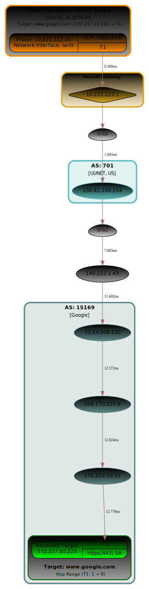
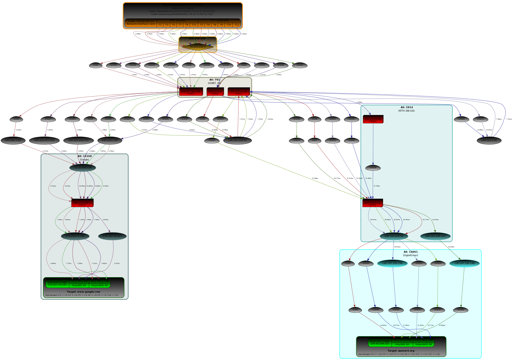
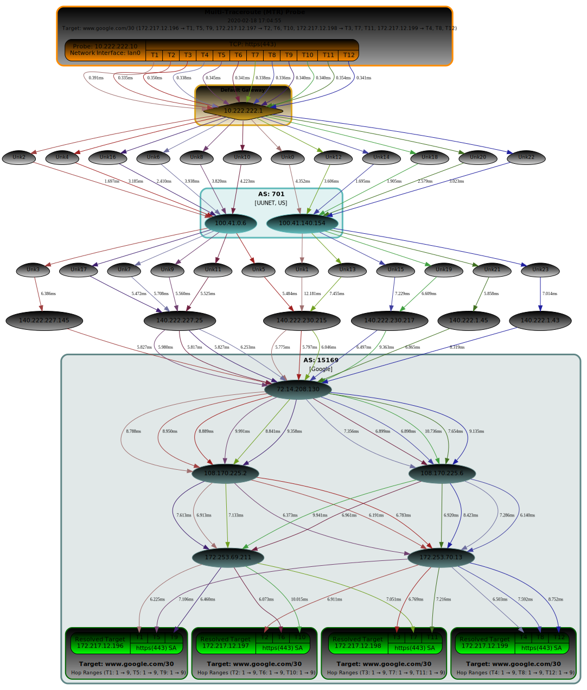

# mtraceroute

  
---
A python3 library for performing an enhanced [scapy](https://github.com/secdev/scapy) Multi-Traceroute (MTR)
with resulting SVG visual.

Features include running multiple queries with each target, display of
Round Trip Time (RTT) calculations, selection of using
Network Protocols: TCP, UDP and ICMP and with enhanced scapy
SVG visual results and session packet capture output.

This library is also used by the [Network Security Toolkit](https://www.networksecuritytoolkit.org) (NST).
The NST (Web User Interface) WUI provides key enhancements including
a GUI options interface, an interactive MTR SVG graphic,
NST IPv4 Address Tools integration, IPv4 Address Geolocation,
MTR session Packet Capture, ASN lookup,
MTR historical session selection and management,
MTR SVG graphic editing, MTR session console output access
and SVG Graphic image conversion.

[Details found on the NST Wiki](https://wiki.networksecuritytoolkit.org/nstwiki/index.php/HowTo_Use_The_Scapy:_Multi-Traceroute_-_MTR)


## Installation
### Pipy

```
TODO
pip3 install mtraceroute
```

### Manual

```
python3.9 -m venv ./venv
source ./venv/bin/activate
pip3 install -r requirements.txt
python3 setup.py install
```

## Usage ##

Use the python3 control script: "mtrrt" to help facilitate the creation of a
Multi-Traceroute (MTR) session.

```
mtrrt --help

*** The mtrrt script performs a Multi-Traceroute (MTR) using scapy - v1.30.2 ***

mtrrt -t || --targets <Target Host List> [-r || --retry <Retry>] [--timeout <Fractional Seconds>]
             [--netproto <Network Protocol>] [--stype <Type> [--sport <Source Port>]]
             [-p || --dports <Destination Service Ports>]
             [--minttl <Min TTL>] [--maxttl <Max TTL>] [--gateway <IPv4 Address>]
             [-g || --graphic <Graphic Type>] [-s || --showpadding] [--privaddr] [--dotfile]
             [-f || --dirfile <SVG Directory File Name>] -i | --interface <Interface Name> [--l3rawsocket]
             [--ptype <Type> [--payload <Payload>]]
             [-q || --nquery <Query Trace Count>] [-w || --wrpcap <pcap Directory File Name>]
             [-a || --asnresolver <ASN Resolver>] [ --vspread <Vertical Node Separation>] [--rtt]
             [--title <Title Text>] [--ts <Title Time Stamp>] [-v || --verbose <level>] [-h || --help]

* Where <Target Host List> and <Destination Ports> are a comma separated string. The <Target Host List> can be in CIDR notation format.
* Use the (--netproto) option to specify the MTR Network Protocol (Must be one of: "TCP" (Default), "UDP", or "ICMP").
* Use the (--stype) option to choose the source port type: "Random" (Default) or "Increment".
* Use the (--sport) option to specify a source port (Default: 50000) for source port type: "Increment".
  If the source port type: "--stype Increment" is used, then the source port will be increased by one (1) for
  each packet sent out during an MTR session.
* Use the (--ptype) option to choose the a packet payload type: "Disabled" (TCP Default) "RandStrTerm" (UDP Default),
 "RandStr" (ICMP Default), "ASCII" or "ASCII-Hex".
* Use the (--payload) option for a ASCII string value (e.g., 'Data1: 56\n') for ptype: "ASCII".
* Use the (--payload) option for a ASCII-Hex string value (e.g., '01fe44fFEf') for ptype: "ASCII-Hex".
  The "--payload ASCII-Hex" option must use 2 ASCII characters to represent one Hexadecimal byte: "f" => "0F" or "0f".
* To add additional TCP destination service ports for tracerouting: "80,443" (Default: "80").
* Use the (-s || --showpadding) to display packets with padding as red triangles.
* The (-a || --asnresolver) option can be: "Disabled", "All", "whois.cymru.com", "riswhois.ripe.net" or "whois.ra.net".
* Use the (--privaddr) option to disable showing an associated AS Number bound box (cluster)
  on the Multi-Traceroute graph for a private IPv4 Address.
* Use the (--timeout) option to limit the time waiting for a Hop packet response (Default: 2.0 seconds).
* Use the (-q || --nquery) count for the number of traces to perform per service target (Default: 1).
* The default graphic type is an SVG graphic: "svg".
* The default directory file name for the resulting mtr graphic: "/tmp/graph.svg".
* Use the (-f || --dirfile) option to change the resulting output directory:
  Example: "-f /var/nst/wuiout/scapy/graph.svg" - Output directory: "/var/nst/wuiout/scapy".
* The default Network Interface will be used to send out the traceroute unless the (-i || --interface) option is used.
* Use the (--gateway) option to override the detected gateway address.
* Increase the verbosity output with a level of 1 or more (Default: 0).
* Use the (--dotfile) option to dump the mtr DOT graph object to a file (.dot file) in the output directory.
* Use the (--vspread) option to set the Vertical Separation in inches between nodes (Default: 0.75in).
* Use the (--rtt) option to display Round-Trip Times (msec) on the graphic for each Hop along a Traceroute.
* Use the (--title) option to override the default Title value: "Multi-Traceroute (MTR) Probe".
* Use the (--ts) option to include the Title Time Stamp text below the Title Text.
* Include internal mtr object variables in output at verbosity level: 8.
* Include trace packet dump output at verbosity level: 9 (***Warning: A large text output may occur).

*** Example:
mtrrt -t "www.google.com,www.networksecuritytoolkit.org" -r 0 --timeout 3.5 --netproto "TCP" -p "80,443" --minttl 1 --maxttl 20 -q 2 -a "All" --vspread 0.60 --rtt -v 1;
```

## Example Runs
Shown are 3 use cases: A simple one, one more complex and a CIDR trace route.

### Simple Run
A single TCP trace route from private host: 10.222.222.10 to target: [www.google.com](https://www.google.com) port: https (443).
This run creates a resultant SVG trace route graphic and packet capture in directory: "/tmp".

```
mtrrt \
  --targets 'www.google.com' \
  --dirfile '/tmp/scapy-mtr_2020-02-18_16-56-30.svg' --nquery 1 --interface 'lan0' \
  --netproto 'TCP' --dports '443' --wrpcap '/tmp/scapy-mtr_2020-02-18_16-56-30.pcap' \
  --retry 0 --minttl 1 --maxttl 30 --asnresolver 'All' --verbose 1 \
  --stype 'Random' --dotfile --rtt --privaddr --ptype 'Disabled' \
  --vspread 0.75 --title 'Multi-Traceroute (MTR) Probe' --ts '2020-02-18 16:56:30' --timeout 2 2>&1;
```



### Complex Run
A more complex TCP trace route from private host: 10.222.222.10 to targets: [www.google.com](https://www.google.com), [openwrt.org](https://openwrt.org) ports: http (80), https (443). Packets returned with padding are also shown.
This run creates a resultant SVG trace route graphic and packet capture in directory: "/tmp".

__Note: To zoom in on the graphic below just open the image in a new tab.__ 

```
mtrrt \
  --targets 'www.google.com,openwrt.org' \
  --dirfile '/tmp/scapy-mtr_2020-02-18_17-00-04.svg' --nquery 3 --interface 'lan0' \
  --netproto 'TCP' --dports '80, 443' --wrpcap '/tmp/scapy-mtr_2020-02-18_17-00-04.pcap' \
  --retry 0 --minttl 1 --maxttl 30 --asnresolver 'All' --verbose 1 \
  --stype 'Random' --dotfile --showpadding --rtt --privaddr --ptype 'Disabled' \
  --vspread 0.75 --title 'Multi-Traceroute (MTR) Probe' --ts '2020-02-18 17:00:04' --timeout 2 2>&1;
```



### CIDR Run
A TCP trace route from private host: 10.222.222.10 to [CIDR](https://en.wikipedia.org/wiki/Classless_Inter-Domain_Routing) targets: [www.google.com/30](https://www.google.com) port: https (443). The use of multiple queries (i.e., --nquery > 1) and CIDR address notation format can help expose load balancing tiers.
This run creates a resultant SVG trace route graphic and packet capture in directory: "/tmp".

__Note: To zoom in on the graphic below just open the image in a new tab.__ 

```
mtrrt \
  --targets 'www.google.com/30' \
  --dirfile '/tmp/scapy-mtr_2020-02-18_17-04-55.svg' --nquery 3 --interface 'lan0' \
  --netproto 'TCP' --dports '443' --wrpcap '/tmp/scapy-mtr_2020-02-18_17-04-55.pcap' \
  --retry 0 --minttl 1 --maxttl 30 --asnresolver 'All' --verbose 1 \
  --stype 'Random' --dotfile --rtt --privaddr --ptype 'Disabled' \
  --vspread 0.75 --title 'Multi-Traceroute (MTR) Probe' --ts '2020-02-18 17:04:55' --timeout 2 2>&1;
```


---
