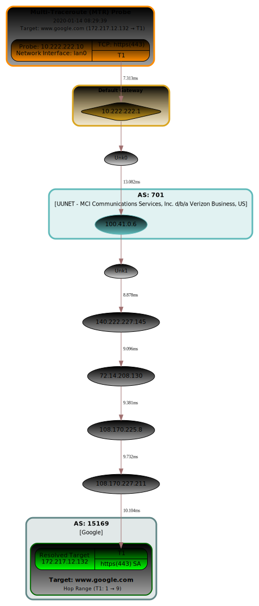

# mtraceroute

 
---
A python3 library for performing an enhanced scapy Multi-Traceroute (MTR)
with resulting SVG visual.

Features include running multiple queries with each target, display of
Round Trip Time (RTT) calculations, selection of using
Network Protocols: TCP, UDP and ICMP and with enhanced scapy
SVG visual results and session packet capture output.

This library is also used by the [Network Security Toolkit](https://www.networksecuritytoolkit.org) (NST).
The NST (Web User Interface) WUI provides key enhancements including
a GUI options interface, an interactive MTR SVG graphic,
NST IPv4 Address Tools integration, IPv4 Address Geolocation,
MTR session Packet Capture, ASN lookup,
MTR historical session selection and management,
MTR SVG graphic editing, MTR session console output access
and SVG Graphic image conversion.

[Details found on the NST Wiki](http://wiki.networksecuritytoolkit.org/nstwiki/index.php/HowTo_Use_The_Scapy:_Multi-Traceroute_-_MTR)


## Requirements

## Example Runs
### Simple Run
A single TCP trace route to *www.google.com*. This run creates 
a resultant SVG trace route graphic and packet capture.

```
mtrrt \
 --targets 'www.google.com' \
 --dirfile '/tmp/scapy-mtr_2020-01-14_08-12-40.svg' --nquery 1 --interface 'lan0' \
 --netproto 'TCP' --dports '443' --wrpcap '/tmp/mtraceroute/scapy-mtr_2020-01-14_08-12-40.pcap' \
 --retry 0 --minttl 1 --maxttl 30 --asnresolver 'All' --verbose 1 \
 --stype 'Random' --dotfile --rtt --privaddr --ptype "Disabled" \
 --vspread 0.75 --title 'Multi-Traceroute (MTR) Probe' --ts '2020-01-14 08:12:40' --timeout 2
```


---
